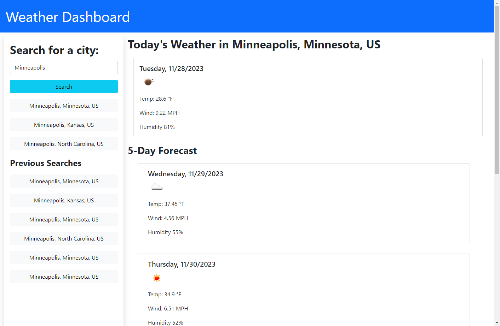

# Weather Dashboard

## Description

This projects is a weather dashboard that allows the user to search a city and get both the current weather and a five-day forecast. The program calls an the openweathermap API for it's data. It will also track what recent searches the user has made and store them in local storage.

## Installation

The pertinent files for the project, including this README can all be found in the Github repository located at: https://github.com/mhalder4/weather-dashboard-challenge. The website can be found at the Github pages address that follows: https://mhalder4.github.io/weather-dashboard-challenge/.

## Usage

The website has a seacrh bar off to the left that can be tyyped in. When the user has entered their desired city, they can hit the seacrh button and a list of buttons for up to 5 cities with that name will pop up below the search button. Clicking one of these city buttons will display the current weather and a five-day forecast on the right hand side of the screen for that user. The website will also save the user's previous searches as clickable buttons in the lower left of the screen. These buttons can also be clicked to display the weather for that city.

## Credits

N/A

## License

MIT License

Copyright (c) 2023 Matthew Halder

Permission is hereby granted, free of charge, to any person obtaining a copy
of this software and associated documentation files (the "Software"), to deal
in the Software without restriction, including without limitation the rights
to use, copy, modify, merge, publish, distribute, sublicense, and/or sell
copies of the Software, and to permit persons to whom the Software is
furnished to do so, subject to the following conditions:

The above copyright notice and this permission notice shall be included in all
copies or substantial portions of the Software.

THE SOFTWARE IS PROVIDED "AS IS", WITHOUT WARRANTY OF ANY KIND, EXPRESS OR
IMPLIED, INCLUDING BUT NOT LIMITED TO THE WARRANTIES OF MERCHANTABILITY,
FITNESS FOR A PARTICULAR PURPOSE AND NONINFRINGEMENT. IN NO EVENT SHALL THE
AUTHORS OR COPYRIGHT HOLDERS BE LIABLE FOR ANY CLAIM, DAMAGES OR OTHER
LIABILITY, WHETHER IN AN ACTION OF CONTRACT, TORT OR OTHERWISE, ARISING FROM,
OUT OF OR IN CONNECTION WITH THE SOFTWARE OR THE USE OR OTHER DEALINGS IN THE
SOFTWARE.